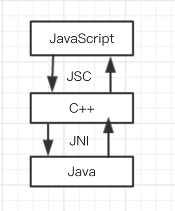
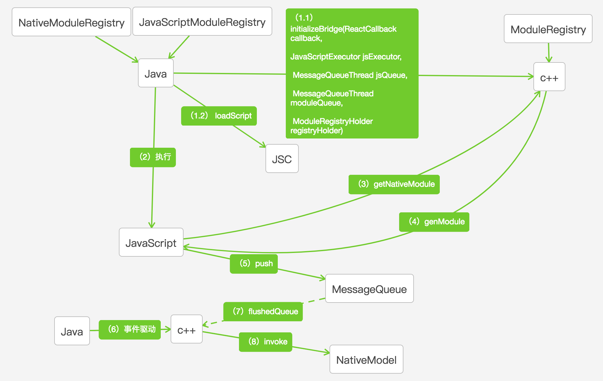
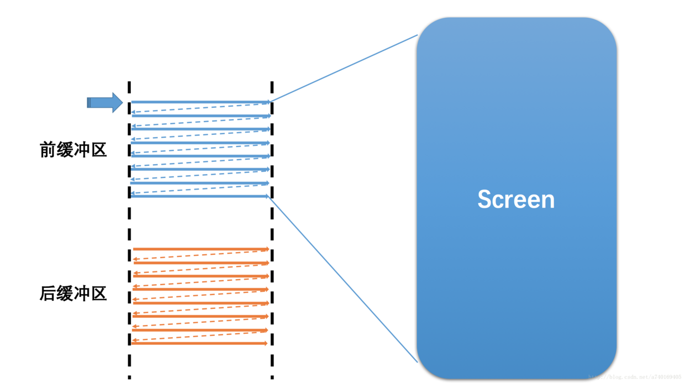
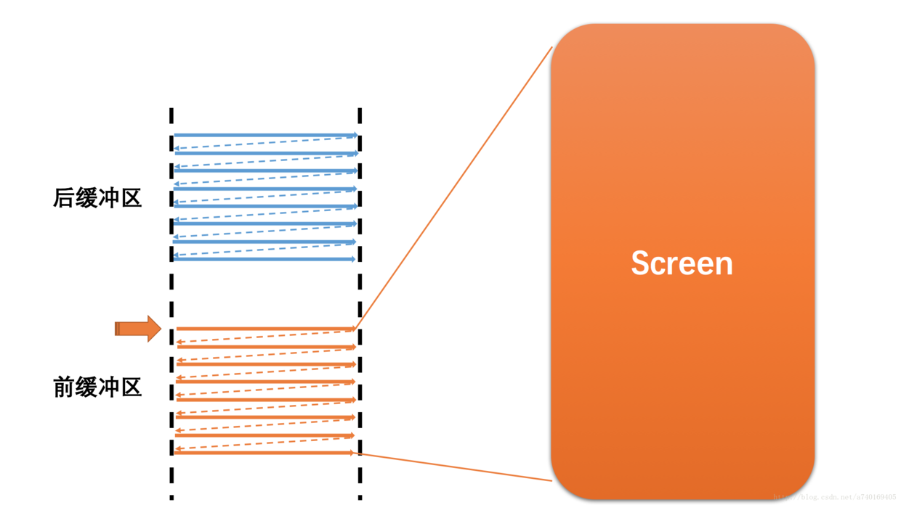
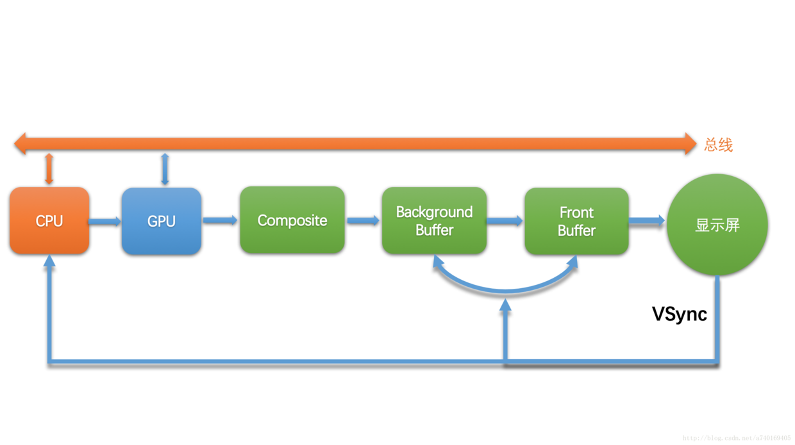
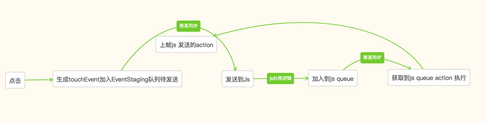
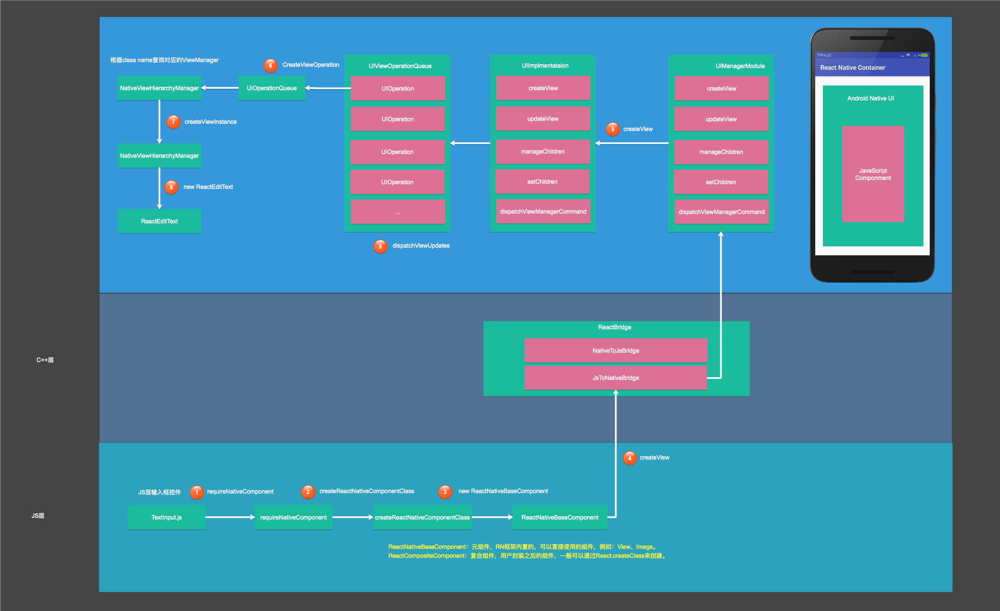
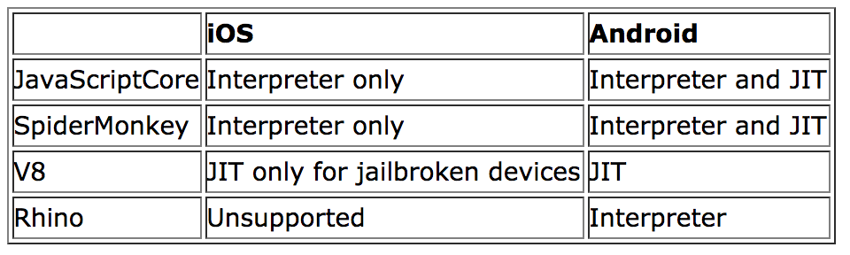
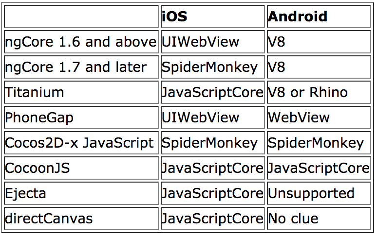

# React Native 

## RN 是什么
使用 JS 语言 
利用现有成熟 React 框架
控制 Native View

A framework for building native apps with React.


## 

- 通信机制

- 线程模型

- 事件驱动

- 渲染原理 

- 脚本执行

## 通信机制



### 



## 线程模型

UI线程：即Android中的主线程，负责绘制UI以及监听用户操作。

Native线程：负责执行C++代码，该线程主要负责Java与C++的通信。

JS线程：负责解释执行JS。

## 事件驱动

### 


### 


### 
屏幕刷新率（HZ）：代表屏幕在一秒内刷新屏幕的次数，Android手机一般为60HZ（也就是1秒刷新60帧，大约16.67毫秒刷新1帧）

系统帧速率（FPS）：代表了系统在一秒内合成的帧数，该值的大小由系统算法和硬件决定。

### 
垂直同步（VSync）：当屏幕从缓冲区扫描完一帧到屏幕上之后，开始扫描下一帧之前，发出的一个同步信号，该信号用来切换前缓冲区和后缓冲区。



### 

```java
 Choreographer

 The choreographer receives timing pulses (such as vertical 
 synchronization)from the display subsystem then schedules 
 work to occur as part of rendering the next display frame.

```

```java
 If your application does its rendering in a different thread,
 possibly using GL,or does not use the animation framework 
 or view hierarchy at all and you want to ensure that it is
  appropriately synchronized with the display, then use
 {@link Choreographer#postFrameCallback}.
```

### 



## 渲染原理

### 


## 脚本执行

### JS引擎选择


### 


## 
思维导图 ：https://www.processon.com/view/link/599c14b8e4b0f2c6342a4f04


